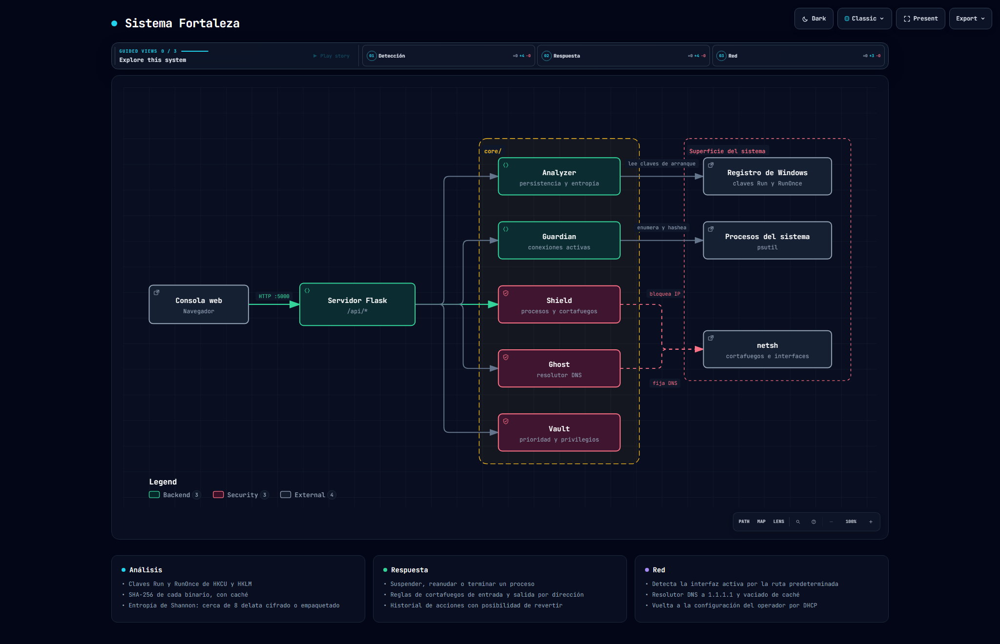

# Sistema Fortaleza

Herramienta de diagnóstico y respuesta para Windows: busca persistencia en el registro, relaciona
cada conexión de red abierta con el proceso que la mantiene y permite actuar sobre lo que
encuentre desde una consola web.

Python · Flask · psutil · winreg



> Diagrama generado con [Archify](https://github.com/tt-a1i/archify) a partir del código de este
> repositorio. Especificación en [`docs/arquitectura.architecture.json`](docs/arquitectura.architecture.json);
> versión navegable en [`docs/arquitectura.html`](docs/arquitectura.html).

---

## Los cinco módulos

Todo el trabajo vive en [`core/`](core), separado por responsabilidad. El servidor Flask solo
coordina.

### `Analyzer` · qué arranca con el sistema

Recorre las tres colmenas donde el malware se engancha para sobrevivir a un reinicio:

```python
(winreg.HKEY_CURRENT_USER,  r"Software\Microsoft\Windows\CurrentVersion\Run")
(winreg.HKEY_LOCAL_MACHINE, r"Software\Microsoft\Windows\CurrentVersion\Run")
(winreg.HKEY_LOCAL_MACHINE, r"Software\Microsoft\Windows\CurrentVersion\RunOnce")
```

De cada entrada saca el SHA-256 del binario y calcula su **entropía de Shannon** sobre los
primeros 10 KB:

```python
entropy = 0
for x in range(256):
    p_x = float(data.count(x)) / len(data)
    if p_x > 0:
        entropy += - p_x * math.log(p_x, 2)
```

Un ejecutable normal ronda 6. Cuanto más se acerca a **8**, más uniforme es la distribución de
bytes: es la firma de un fichero cifrado, comprimido o empaquetado para esconder lo que hace.

### `Guardian` · quién está hablando con fuera

Enumera las conexiones con `psutil.net_connections(kind='inet')` y remonta cada una hasta su PID,
su ejecutable y el hash de ese ejecutable. El hash se cachea con `functools`, porque el mismo
binario aparece en muchas conexiones y calcularlo cada vez bloquearía la interfaz.

### `Shield` · cortar

Suspende, reanuda o termina un proceso, y levanta reglas de cortafuegos contra una dirección en
los dos sentidos y en los tres perfiles de red:

```
netsh advfirewall firewall add rule name="FORTALEZA_BLOCK_<ip>_OUT" dir=out action=block remoteip=<ip> profile=any
netsh advfirewall firewall add rule name="FORTALEZA_BLOCK_<ip>_IN"  dir=in  action=block remoteip=<ip> profile=any
```

### `Ghost` · red

Detecta la interfaz activa leyendo la tabla de rutas en vez de suponerla, cambia el resolutor DNS
a `1.1.1.1` / `1.0.0.1`, deja IPv6 sin resolutor para que no se filtren consultas por ahí, y vacía
la caché. La vuelta atrás devuelve la interfaz a DHCP.

### `Vault` · privilegios

Comprueba que el proceso tiene permisos de administrador —sin ellos ni `netsh` ni las colmenas de
`HKLM` responden— y sube su prioridad de planificación para que el análisis no se quede atrás
cuando el sistema está cargado.

## La consola

Flask sirve una interfaz de una sola página con la lista de nodos detectados, el historial de
acciones y los botones para actuar.

| Ruta | Qué devuelve |
|---|---|
| `GET /api/nodes` | Conexiones y procesos detectados |
| `GET /api/history` | Historial de acciones ejecutadas |
| `GET /api/scan_proactive` | Lanza un análisis de persistencia |
| `POST /api/action` | Aísla, termina o bloquea |
| `POST /api/ghost/toggle` | Activa o desactiva el cambio de DNS |
| `POST /api/revert` | Deshace una acción del historial |

Las acciones se ejecutan en un hilo aparte para que la interfaz no se congele mientras `netsh`
responde.

## Estructura

```
main.py                  eleva privilegios y arranca
core/
├── analyzer.py          registro, hashes y entropía
├── guardian.py          conexiones y procesos
├── shield.py            terminar procesos y reglas de cortafuegos
├── ghost.py             resolutor DNS de la interfaz activa
└── vault.py             privilegios y prioridad
web/
├── server.py            API y coordinación
├── templates/index.html
└── static/              consola
```

## Requisitos y arranque

Windows, Python 3 y **permisos de administrador**: sin ellos no se puede leer `HKLM`, ni cambiar
reglas de cortafuegos, ni tocar la configuración DNS de una interfaz.

```bash
pip install -r requirements.txt
python main.py
```

`main.py` detecta si se ha lanzado sin privilegios y se relanza a sí mismo pidiéndolos. La consola
queda en el puerto `5000`.
